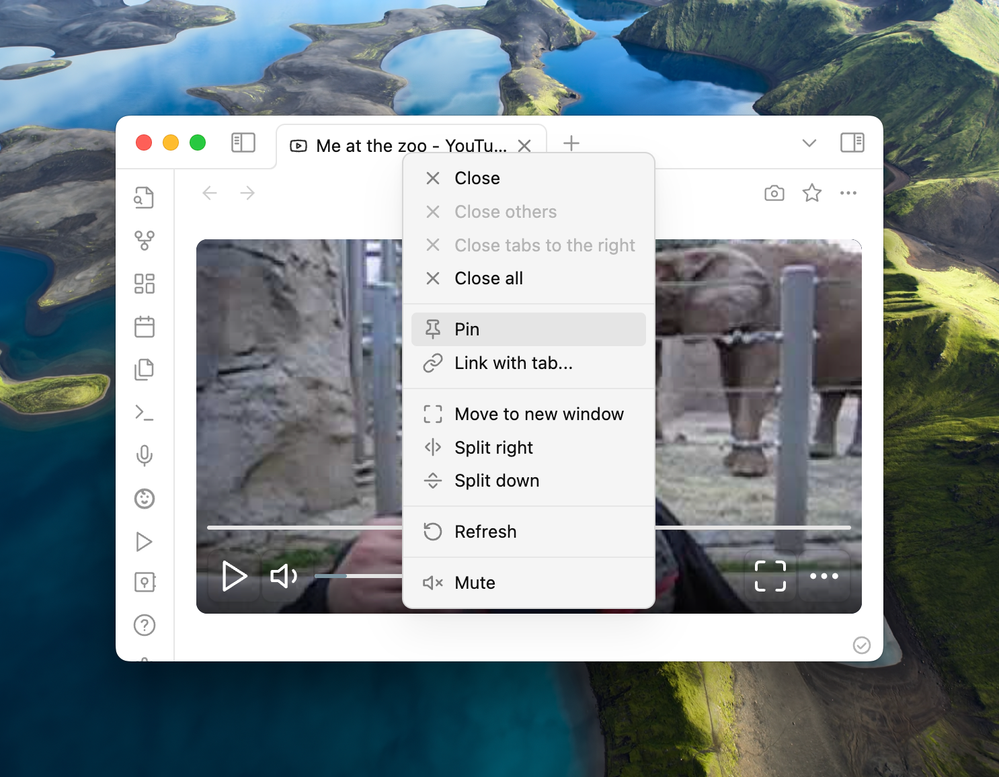

import { Bleed } from "nextra-theme-docs";

import { FaExclamationTriangle } from "react-icons/fa";

# 常见问题解答

import { Cards, Card } from "nextra/components";

{/* <Cards>
  <Card
    icon={<FaExclamationTriangle />}
    title="已知 Bug"
    href="/faq/known-issue"
  />
</Cards> */}

## 我不想每个媒体都打开单独的播放器 [#shared-player]

当您需要处理含有不同媒体的多份笔记时，频繁打开新的播放器可能会很烦人。Media Extended 通过与 Obsidian 的“固定标签页”功能集成，巧妙解决了这一问题。只需右键点击播放器标签并选择“固定”，即可实现多个视频在同一个播放器打开。

<Bleed>

</Bleed>

## 我想在 Obsidian 中打开浏览器中的网页 [#open-website]

你可以使用下面的`bookmarklet`来在 Obsidian 中打开当前网页。只需在浏览器中创建一个新的书签，并将下面的代码粘贴到 URL 字段中。

```javascript copy
javascript:(()=>{const o=document.querySelector("video, audio")?.currentTime;let e=window.location.href;o===null?e+="":window.location.hash?e+=`&t=${o}`:e+=`#t=${o}`;window.open(`obsidian://mx-open?url=${encodeURIComponent(e)}`);})();
```

当然，您也可以手动在浏览器地址栏中加入以下前缀并按回车键：

```text copy
obsidian://mx-open/
```

## XXX 网站在播放器打不开 [#website-not-working]

如果你想打开的网站是 Media Extended 官方支持的，你可以在 GitHub 仓库 里提 [新 Issue](https://github.com/PKM-er/media-extended/issues/new)。

目前支持的网站如下：
- YouTube
- Vimeo
- bilibili
- Coursera

如果你想打开的网站未被官方支持的，你可以先在浏览器中测试是否可以正常访问。如果在浏览器中可以，但在播放器中不能打开，你可以在 GitHub discussions 里请求支持。

在请求新网站支持之前，首先检查是否已经有人请求过：[已经请求过的网站](https://github.com/PKM-er/media-extended/discussions/categories/website). 
如果已经有人提过请求，你可以给他们的请求点赞⬆️。

请求新网站支持，请前往 [请求新网站支持](https://github.com/PKM-er/media-extended/discussions/new?category=website)
你至少需要提供以下信息：
- 示范链接，用于匹配网站
- 可以公开访问的资源链接，用于测试

## 我希望能关联任意笔记的功能，而不是仅限于在 Media 笔记记录时间戳/截屏 [#restore-link-with-pane]

["Link with pane"](https://github.com/PKM-er/media-extended/wiki/Open-Links-in-One-Shared-Player) 功能在 v3 中已经被重新设计，现在您可以在任意活跃的笔记上使用命令或您自行分配的快捷键来控制播放器，不需要再像以前一样特意将播放器与笔记关联。

您可能会注意到在记笔记时，播放器在标签页顶部以 🟥 红色图标标记，这表示该播放器处于“活跃”状态，正在被用于记录笔记。

关于媒体命令和快捷键的具体内容，请参考[#记笔记](/getting-started/first-note#taking-notes)

## YouTube 视频在网页播放器自动暂停 [#youtube-auto-pause]

这通常意味着 YouTube 正在请求您的同意来使用 cookie。您可以通过使用命令“登录网站”在登录浏览器中打开 [youtube.com](https://youtube.com) 来解决这个问题。

在 Media Extended v3.0.7 中，当您打开 YouTube 视频时，应该会有一个提示要求您处理这种情况。

[Issue #219](https://github.com/PKM-er/media-extended/issues/219)