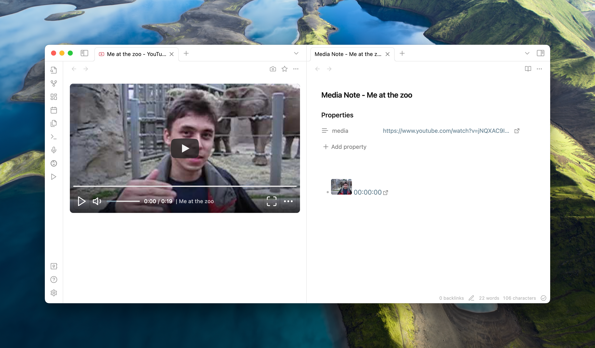

import { Cards, Card } from "nextra/components";
import { FaDownload, FaHammer } from "react-icons/fa6";

# Media Extended

Enhanced media playback for obsidian.md 🎥📚

This plugin is designed to enrich your note-taking experience in obsidian.md by seamlessly integrating multimedia content into your notes. Whether you're a student, researcher, or content creator, this plugin makes it easier to incorporate, control, and reference audio and video materials directly within your digital notebook.

import { Bleed } from "nextra-theme-docs";

<Bleed>
  
</Bleed>

## Getting Started 🚀 [#getting-started]

<Cards>
  <Card
    icon={<FaDownload />}
    title="Installation"
    href="/getting-started/install/"
  />
  <Card
    icon={<FaHammer />}
    title="Basic Usage"
    href="/getting-started/first-note/"
  />
</Cards>

## Features 🌟 [#features]

- **Seamless Integration with Obsidian** 🤝: Works perfectly with Obsidian's live preview and multi-window support, ensuring a smooth workflow.
- **Embed Multimedia Files** 📁: Easily embed both local or hosted video and audio files directly into your notes, bringing your content to life.
- **Playback Control** ⏯️: Utilize commands and keyboard shortcuts for efficient playback control, including play, pause, skip, and timestamping for quick references.
- **Support for Multiple Video Platforms** 🌐: Enjoy support for popular platforms like YouTube, Vimeo, Coursera, Bilibili, and more. In theory, if it can be streamed on a webpage, we've got it covered.
- **Local Subtitle Support** 📑: Enhance your media with local subtitle files in SRT, VTT, and ASS formats, making it easier to follow along or understand content in another language.
- **Media Fragments** 🎞️: Create media fragments that play only within a specified range, perfect for focusing on specific parts of a lecture or presentation.

## Coming Next 🔮 [#features-next]

- **Mobile support**📱
- **Metadata and Subtitle Extraction** 📊: Pull metadata and subtitles directly from YouTube and Bilibili.
- **Playlist Support** 📋: Organize your media files into playlists for continuous playback.
- **Canvas Support** 🎨: Supercharge Canvas for an immersive, interactive idea exploration experience.
- (Paid Features) **AI Summary for Transcript** 🤖: Get concise summaries of your media's content.
- (Paid Features) **Table/Text OCR for Screenshots** 📷: Extract text from images for easy reference and integration.
- (Paid Features) **Transcript Generation from Video** 📝: Automatically generate text transcripts from your video content.
